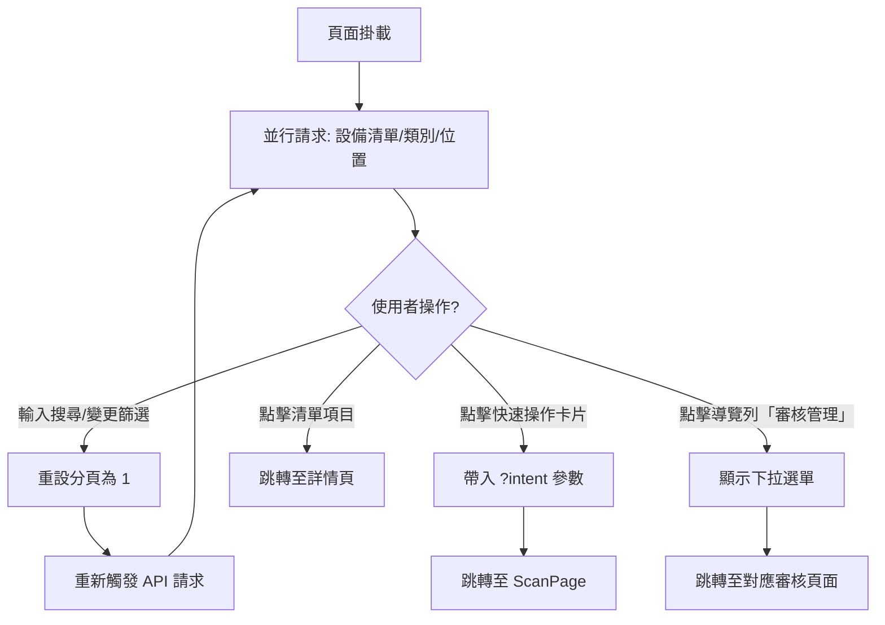
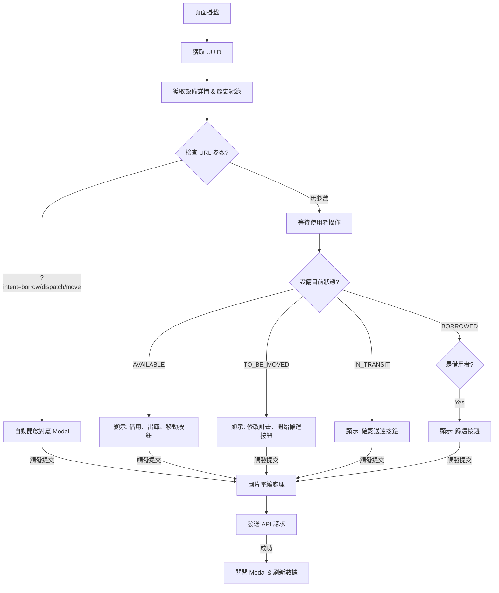
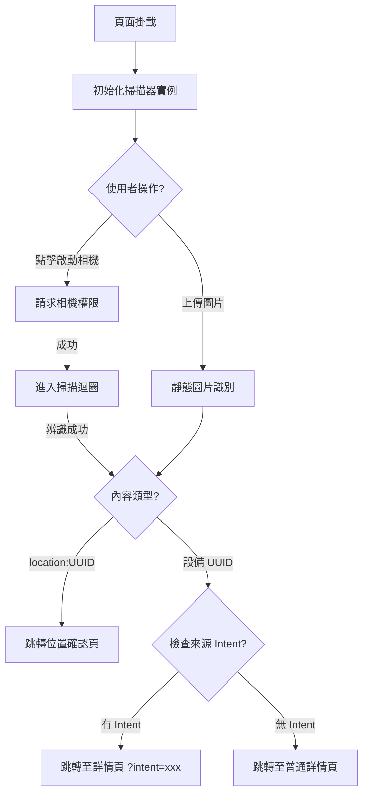
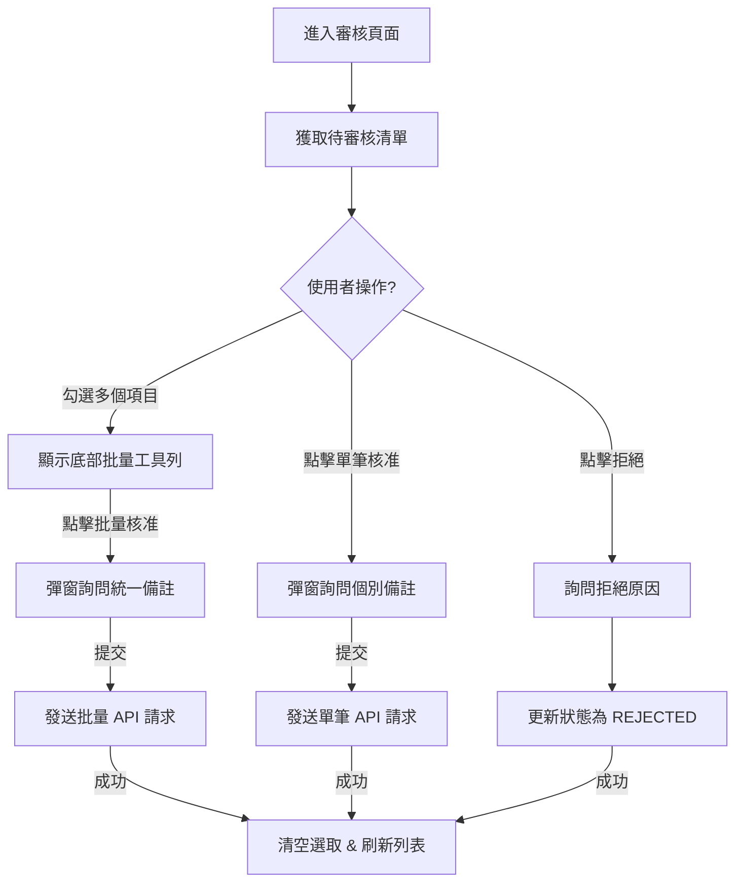

# QR-EMS 頁面詳細邏輯圖解

本文件使用 Mermaid 流程圖詳述各核心頁面的內部執行邏輯。

---

## 1. 首頁 (Dashboard) 邏輯
**核心功能：** 數據過濾、導航分流。

---

## 2. 設備詳情頁 (Detail Page) 邏輯
**核心功能：** 意圖偵測、狀態機按鈕、表單整合。

---

## 3. 掃描頁 (ScanPage) 邏輯
**核心功能：** 相機控制、內容識別、意圖路由。

---

## 4. 管理審核頁 (Admin Requests) 邏輯
**核心功能：** 批量操作、審核追蹤。

