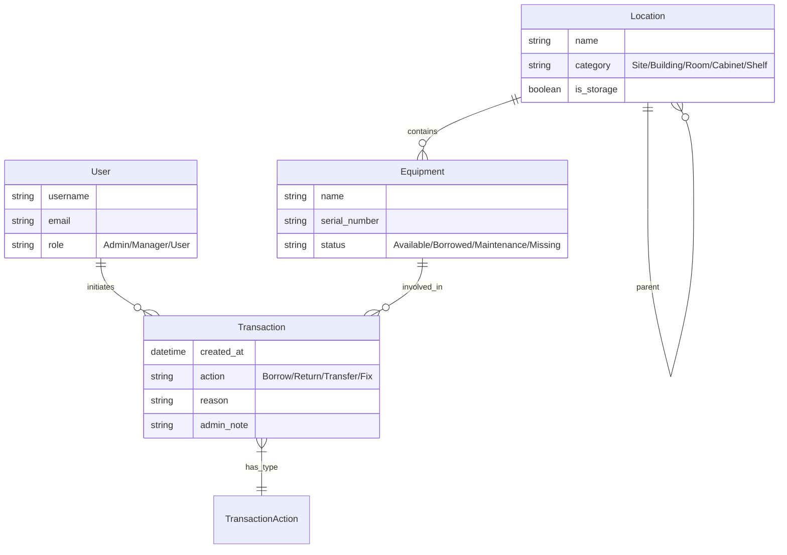

# 系統架構說明 (Architecture)

## 🏗️ 總體架構

QR-EMS 採用現代化的前後端分離架構，並完全容器化以支援快速開發與部署。

```text
[ Browser / Mobile ] <---> [ Cloudflare Tunnel ] <---> [ Docker Compose ]
                                                               |
                                        +----------------------+----------------------+
                                        |                      |                      |
                                 [ Vite Frontend ]      [ Django Backend ]      [ PostgreSQL ]
```

---

## 💻 詳細技術棧 (Detailed Tech Stack)

| 層級 | 技術 / 工具 | 關鍵特性與用途 |
| :--- | :--- | :--- |
| **前端 (Frontend)** | **React 19** | 併發渲染 (Concurrent Rendering) 提升介面響應速度 |
| | **TypeScript** | 強型別開發，確保與後端資料結構一致性 |
| | **Vite** | 極速 HMR 與高效能建置工具 |
| | **TanStack Query (v5)** | 伺服器狀態管理 (Cache, Prefetch, Loading/Error 處理) |
| | **Zustand** | 輕量化全域狀態管理 (Auth, Layout) |
| | **Tailwind CSS** | 原子化 CSS，確保跨平台 (Mobile/PC) UI 一致性 |
| | **html5-qrcode** | 跨平台相機掃描解決方案 |
| **後端 (Backend)** | **Django 6.0** | 強大 ORM、安全機制與內建管理後台 |
| | **Django REST Framework** | 構建標準 RESTful API，支援複雜過濾與分頁 |
| | **Service Layer** | 抽離核心邏輯至 `services.py`，提升測試性與一致性 |
| | **SimpleJWT** | 無狀態 JWT 驗證 (Access/Refresh Token) |
| | **drf-spectacular** | 自動生成 OpenAPI 3.0 (Swagger) 文檔 |
| **基礎設施 (Infra)** | **Docker & Compose** | 環境隔離與快速部署，確保開發環境一致性 |
| | **PostgreSQL 16** | 穩定且高效能的關聯式資料庫 |
| | **Cloudflare Tunnel** | Zero Trust 安全技術，無需開啟端口即可外網訪問 |

---

## 📁 核心資料夾結構

| 目錄路徑 | 負責功能 |
| :--- | :--- |
| `/backend/apps/equipment` | 資產 (Equipment) CRUD、分類管理、QR Code 生成 |
| `/backend/apps/transactions` | 借還流程 (Borrow/Return)、移動計畫、審核流水線 |
| `/backend/apps/locations` | 位置 (Location) 層級樹狀結構維護 |
| `/frontend/src/api` | 封裝所有 Axios 請求、攔截器與 TypeScript 型別定義 |
| `/frontend/src/pages/Admin` | 後台管理模組 (設備、人員分配、入庫審核、分類與位置) |

---

## 🗄️ 資料庫實體關係 (ERD)

以下簡化圖表展示了核心模型之間的關聯。



*   **Location (位置)**: 採用「鄰接列表 (Adjacency List)」模式，`parent` 欄位指向自身，形成樹狀結構。
*   **Transaction (交易)**: 記錄所有變更操作。每一次的借出、歸還或移動都會產生一筆新的 Transaction，確保稽核軌跡完整。

---

## 🔐 安全機制

*   **Zero Trust**: 透過 Cloudflare Tunnel 暴露服務，不需開啟防火牆端口。
*   **Authentication**: 整合 Google OAuth 與 JWT (SimpleJWT) 雙重機制。
*   **Permission (RBAC)**: 嚴格的角色存取控制，區分 `Admin` (管理員)、`Manager` (主管) 與 `User` (一般用戶)。