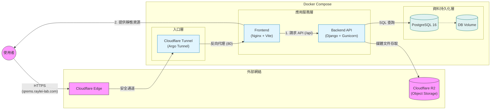

# 系統架構

此圖表展示了 QR-EMS 應用程式在生產環境 Docker 中的當前架構。

## 組件詳情

- **Cloudflare Tunnel (`tunnel`)**：建立與 Cloudflare 的安全出站連接。它接收來自 `qrems.raylei-lab.com` 的流量，並將其路由到內部 `frontend` 服務的 80 端口。
- **前端服務 (`frontend`)**：
  - 運行 **Nginx**。
  - 提供構建好的 React 應用程式（靜態文件）。
  - 作為反向代理（Reverse Proxy），將 `/api` 和 `/admin` 請求轉發到 `backend` 服務。
- **後端服務 (`backend`)**：
  - 運行 **Django** 和 **Gunicorn**（在 8000 端口）。
  - 處理業務邏輯和 API 請求。
- **資料庫 (`db`)**：
  - 運行 **PostgreSQL 16**。
  - 儲存應用程式數據。
